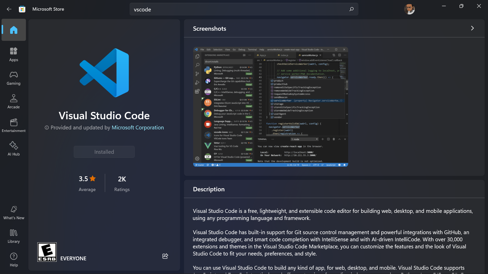
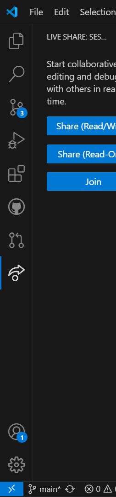

# SE-Assignment-5
Installation and Navigation of Visual Studio Code (VS Code)
 Instructions:
Answer the following questions based on your understanding of the installation and navigation of Visual Studio Code (VS Code). Provide detailed explanations and examples where appropriate.

 Questions:

1. Installation of VS Code:
   - Describe the steps to download and install Visual Studio Code on Windows 11 operating system. Include any prerequisites that might be needed.
   Step 1: First make sure your system meets the least requirements to install and run visual studio code.
   Step 2: 
   Step 3: Launch the app and agree to the licenses. Give the software the necessary permissions.
   Step 4: Run the software and install the necessary extensions

2. First-time Setup:
   - After installing VS Code, what initial configurations and settings should be adjusted for an optimal coding environment? Mention any important settings or extensions.

   Personally for me, I started with setting the auto save feature. It really helps to automatically update your code after saving. Number 2, I then download afew extentions like live server that displays your html file in your browser. . There are also so many other extentions that you can install like prettier for formatting code, deppending on your preferences

3. User Interface Overview:
   - Explain the main components of the VS Code user interface. Identify and describe the purpose of the Activity Bar, Side Bar, Editor Group, and Status Bar.

   1. Activity Bar: It is located on the left side of the window. Provides access to different views and major functions. By default, it includes icons for:
      Explorer: For file navigation and management.
      Search: For searching across files.
      Source Control: For version control integration (e.g., Git).
      Run and Debug: For running and debugging applications.
      Extensions: For managing extensions.
      GitHub: To access your github classrooms, pull requests and issues
      Live share: To collaboratively edit and debug with others real-time
    
   2. Side Bar: it is located right next to the Activity Bar. Displays the contents related to the selected view in the Activity Bar. Depending on the selected activity, it can show:
        File Explorer: Lists files and directories in your workspace.
        Search Results: Displays search results when using the search function.
        Source Control Information: Shows Git status, changes, and commit history.
        Debug Information: Provides controls and information for running and debugging code.
        Extension Information: Lists installed extensions and those available for installation.

   3. Editor Group:It is located in the central area of the window. The main workspace where you edit your files. It can be divided into multiple groups:
        Tabs: Each open file is represented by a tab at the top of the editor group.
        Split Editors: You can split the editor horizontally or vertically to view and edit multiple files side-by-side.
        Features: Syntax highlighting, code completion, error checking, and more.

   4. Status Bar:It is located at the bottom of the window.Provides information about the current state of the editor and workspace. It includes:
        Current File Information: Displays details like the current line and column number.
        Language Mode: Shows the language mode of the file being edited and allows changing it.
        Git Information: Displays the current branch and changes if Git is being used.
        Notifications: Shows notifications and alerts related to extensions, errors, and more.
        Customization: You can customize what is shown on the status bar through settings and extensions.

4. Command Palette:
   - What is the Command Palette in VS Code, and how can it be accessed? Provide examples of common tasks that can be performed using the Command Palette.

   The command palette is a tool that provides quick access to various commands and features without needing to navigate through menus or remember complex keyboard shortcuts.

5. Extensions in VS Code:
   - Discuss the role of extensions in VS Code. How can users find, install, and manage extensions? Provide examples of essential extensions for web development.

   Extensions play a crucial role in Visual Studio Code by enhancing its functionality and customizing the editor to fit specific development needs. They can add support for new programming languages, debuggers, and tools, as well as integrate with external services and improve overall productivity.

6. Integrated Terminal:
   - Describe how to open and use the integrated terminal in VS Code. What are the advantages of using the integrated terminal compared to an external terminal?

   The integrated terminal in Visual Studio Code (VS Code) allows you to run command-line tools directly within the editor, providing a seamless development experience. It is aware of the workspace context, meaning it opens in the root directory of your project. You can access it by using the command ctrl + shift + `

7. File and Folder Management:
   - Explain how to create, open, and manage files and folders in VS Code. How can users navigate between different files and directories efficiently?

8. Settings and Preferences:
   - Where can users find and customize settings in VS Code? Provide examples of how to change the theme, font size, and keybindings.

9. Debugging in VS Code:
   - Outline the steps to set up and start debugging a simple program in VS Code. What are some key debugging features available in VS Code?

10. Using Source Control:
    - How can users integrate Git with VS Code for version control? Describe the process of initializing a repository, making commits, and pushing changes to GitHub.

 Submission Guidelines:
- Your answers should be well-structured, concise, and to the point.
- Provide screenshots or step-by-step instructions where applicable.
- Cite any references or sources you use in your answers.
- Submit your completed assignment by 1st July 

